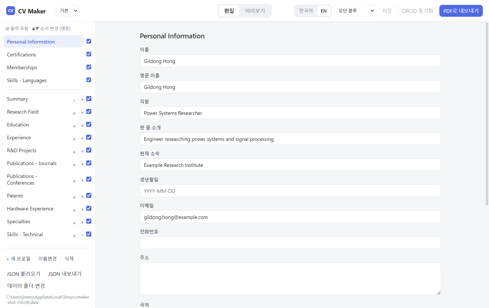
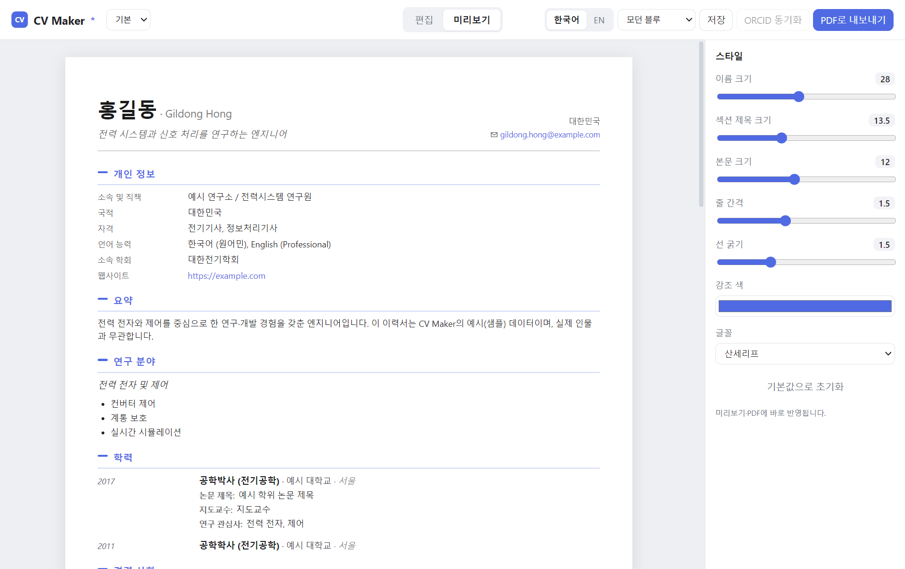

# CV Maker

*An offline, bilingual (Korean / English) desktop résumé maker built with Electron + Vue 3. Open source, MIT licensed.*

[](https://github.com/hj801js/cv-maker/actions/workflows/ci.yml)

📖 **사용 설명서: [docs/manual.html](docs/manual.html)** — 브라우저에서 열면 모든 기능을 그림과 함께 볼 수 있습니다.

오프라인 데스크톱 이력서(CV) 편집기입니다. **Electron + Vue 3**으로 만들었고, 데이터는
서버 없이 로컬 JSON 파일에 저장됩니다. 한 사람의 이력서를 **한국어 / 영어 두 벌**로 따로
관리하고, 화면에서 본 그대로 **A4 PDF**로 내보낼 수 있습니다.

- 완전 오프라인 — ORCID 동기화를 쓸 때만 인터넷이 필요합니다.
- 한/영 데이터 분리, 언어 토글 한 번으로 전환.
- 섹션 표시/숨김, 순서 변경, 한글 표 레이아웃.
- 여러 개의 이름 있는 프로필(서로 다른 이력서)을 두고 드롭다운으로 전환.
- ORCID에서 논문/특허를 가져와 최신순 자동 정렬.
- 편집 즉시 자동 저장(디바운스) + `.bak` 백업.

## 화면

**편집** — 왼쪽에서 섹션 표시·순서, 오른쪽에서 항목 편집


**미리보기 + 스타일** — A4 미리보기(WYSIWYG)와 우측 스타일 사이드바


> 화면의 데이터는 함께 배포되는 샘플(가상 인물 *홍길동 / Gildong Hong*)입니다.

---

## 요구 사항

- [Node.js](https://nodejs.org/) 18 이상 (개발/빌드용). 설치본을 쓰는 최종 사용자는 필요 없습니다.
- Windows (설치본 타깃은 Windows NSIS / 포터블). macOS·Linux에서도 `npm run dev`로 개발은 가능합니다.

## 설치 및 실행 (개발 모드)

```bash
npm install      # 최초 1회 의존성 설치
npm run dev      # Vite 개발 서버 + Electron 창 실행
```

## 빌드 및 설치본 만들기

```bash
npm run build    # 렌더러(dist/) + Electron 메인(dist-electron/) 컴파일만
npm run dist     # 위 빌드 후 설치본 패키징 → release/ 에 생성
npm run pack     # 패키징 없이 압축 해제된 앱 폴더만 (release/win-unpacked)
```

`npm run dist`는 `release/` 폴더에 두 가지 산출물을 만듭니다.

- **NSIS 설치 프로그램** (`CV Maker Setup x.y.z.exe`) — 일반적인 설치형.
- **포터블 실행 파일** (`CV Maker x.y.z.exe`) — 설치 없이 바로 실행.

> **Windows 패키징 참고:** `electron-builder`가 코드서명 도구(winCodeSign)를 풀 때 심볼릭 링크를
> 만들기 때문에, Windows에서는 **개발자 모드**를 켜거나 **관리자 권한 터미널**에서 빌드해야 합니다.
> (인증서가 없으면 서명은 자동으로 건너뜁니다.) 켜지 않으면 `npm run dist`가 winCodeSign 압축 해제
> 단계에서 멈춥니다.

앱 아이콘을 바꾸려면 `build/icon.svg`를 수정한 뒤 다시 생성합니다.

```bash
npm run gen-icon # build/icon.svg → build/icon.ico (+ icon.png)
```

---

## 데이터가 저장되는 위치

이력서 내용과 앱 설정은 **분리**되어 저장됩니다.

### 1) 이력서 데이터 — 문서 폴더

기본 경로는 `문서\CV_maker\` 입니다 (Windows의 Documents 폴더 아래). 앱 안에서
**데이터 폴더 변경** 버튼으로 다른 폴더를 지정할 수 있습니다.

각 프로필은 **언어별 파일 한 쌍**으로 저장됩니다 (스키마 v4).

```
문서\CV_maker\
  ├─ 기본_KR.json     ← "기본" 프로필의 한국어 이력서
  ├─ 기본_EN.json     ← "기본" 프로필의 영어 이력서
  ├─ 홍길동_KR.json    ← 다른 프로필도 같은 방식으로
  └─ 홍길동_EN.json
```

파일 형식:

```jsonc
{
  "_meta": { "schemaVersion": 4, "lang": "ko" },
  "hidden": ["specialties"],   // 출력에서 제외한 섹션 키 목록
  "cv": { "basicInfo": { ... }, "summary": "...", ... }
}
```

저장 동작:

- 편집하면 약 1초 후 자동 저장되고, 창이 비활성화되거나 닫힐 때도 저장됩니다.
- 저장 시 직전 내용을 `<파일>.bak`으로 백업합니다.
- 임시 파일에 먼저 쓰고 이름을 바꾸는 방식(atomic write)이라 저장 중 손상 위험이 낮습니다.

### 2) 앱 설정 — AppData

활성 프로필, 마지막 언어, 섹션 순서, 한글 표 섹션 목록, 데이터 폴더 경로 등은
이력서 내용과 별개로 다음 위치에 저장됩니다.

```
%APPDATA%\cv-maker\config.json   (예: C:\Users\<사용자>\AppData\Roaming\cv-maker\config.json)
```

> 처음 실행할 때 데이터 폴더에 이력서 파일이 하나도 없으면, 번들된 시드(`기본` 프로필)를
> 만들어 시작합니다.

---

## 프로필 (여러 개의 이력서)

상단 드롭다운에서 프로필을 전환합니다. 편집 화면 왼쪽 아래에서 관리합니다.

- **+ 새 프로필** — 현재 데이터를 새 이름으로 복제해 새 프로필을 만듭니다.
- **이름변경** — 현재 프로필 이름을 바꿉니다(두 언어 파일 모두 함께 변경).
- **삭제** — 현재 프로필을 삭제합니다(마지막 하나는 삭제 불가).

프로필 이름은 파일명이 되므로 `\ / : * ? " < > |` 문자는 자동 제거되고 60자로 잘립니다.

---

## 언어 전환 (한국어 / 영어)

상단 오른쪽 **한국어 / EN** 토글로 전환합니다(기본값은 영어).

- 두 언어는 **완전히 독립된 데이터**입니다. 한국어 이력서와 영어 이력서를 따로 채웁니다.
- 섹션 표시/숨김 설정도 언어별로 따로 기억됩니다.
- 편집·미리보기·PDF·JSON 내보내기는 모두 **현재 선택된 언어**를 대상으로 동작합니다.

---

## 섹션 순서와 표시 / 숨김

편집 화면 왼쪽 섹션 목록에서 조정합니다.

- **체크박스** — 체크된 섹션만 미리보기·PDF에 출력됩니다(언어별로 기억).
- **▲ / ▼** — 큰 섹션들의 출력 순서를 바꿉니다.
- **기본 정보·자격증·소속 학회·언어** 섹션은 고정되어 순서 변경 대상이 아닙니다.

## 한글 표 레이아웃

한국어일 때, 표를 지원하는 섹션(학력·경력·과제·논문·특허·하드웨어 실험 등) 옆에 **표**
버튼이 나타납니다. 켜면 그 섹션이 **번호 · 내용 · 날짜** 3열 표로 출력됩니다.

- 내용이 비어 있는 열(예: 날짜가 전부 없으면)은 자동으로 빠집니다.
- 표 스타일은 **한국어 전용**이며, 섹션별로 따로 켜고 끌 수 있습니다.

---

## JSON 가져오기 / 내보내기

다른 컴퓨터로 옮기거나 백업할 때 사용합니다. **현재 언어**의 데이터가 대상입니다.

- **JSON 내보내기** — 현재 언어 이력서를 `<프로필>_KR.json` 또는 `<프로필>_EN.json`으로 저장.
- **JSON 불러오기** — 파일을 골라 현재 데이터에 덮어씁니다.

> 불러올 때 **언어는 파일명으로 판별**합니다. 파일명이 `..._KR.json`/`..._KO.json`이면 한국어,
> `..._EN.json`이면 영어로 들어갑니다. 그 외 이름은 거부되며, 내용이 이력서 형식이 아니어도
> 거부됩니다(실수로 엉뚱한 언어/파일을 덮어쓰는 것을 막기 위함).

---

## ORCID 동기화

기본 정보에 **ORCID ID**(`0000-0000-0000-0000` 형식)를 입력하면 **ORCID 동기화** 버튼이
활성화됩니다. 누르면 ORCID 공개 API에서 저작물을 가져와 **현재 언어** 이력서에 추가합니다.

- 저널 논문 / 학회 논문 / 특허로 자동 분류해 각 섹션에 넣습니다.
- 제목 기준으로 **중복은 건너뜁니다**(이미 있는 항목은 다시 추가하지 않음).
- 추가 후 논문·특허를 **최신순(연도/월 내림차순)**으로 정렬합니다.

---

## PDF 내보내기

**PDF로 내보내기** 버튼(또는 `Ctrl+P`)으로 저장합니다.

- 미리보기는 **A4 페이지 단위**로 나뉘어 표시되며, **화면에서 본 그대로** PDF가 됩니다(WYSIWYG).
- 각 페이지에는 14mm 안쪽 여백이 들어갑니다.
- 파일명은 `CV_<이름>_<연도>_<KO|EN>.pdf` 형태로 제안됩니다(이름은 영문 기준).

---

## 키보드 단축키

| 단축키 | 동작 |
| --- | --- |
| `Ctrl + S` | 저장 |
| `Ctrl + P` | PDF로 내보내기 |
| `Ctrl + Shift + O` | 데이터 폴더 열기 |
| `Ctrl + Z` / `Ctrl + Shift + Z` | 실행 취소 / 다시 실행 |
| `Ctrl + =` / `Ctrl + -` / `Ctrl + 0` | 확대 / 축소 / 실제 크기 |
| `Ctrl + R` | 새로고침 |
| `F11` | 전체화면 |
| `Ctrl + Q` | 종료 |

---

## 테스트

핵심 순수 로직(논문/특허 정렬 키, 가져오기 파일명 언어 판별, 프로필명 정리, 섹션 순서/마이그레이션
정규화)은 `src/lib/`·`electron/lib/`로 분리되어 단위 테스트로 검증됩니다.

```bash
npm test     # vitest 단위 테스트 실행
```

설치 가능한 산출물 자체는 **스모크 테스트**로 검증합니다 — 임시 데이터 폴더에서 실제 패키징 exe를
띄워 시드 로드·렌더·언어 토글·PDF 내보내기를 확인합니다(실제 이력서 데이터는 건드리지 않습니다).

```bash
npm run pack    # release/win-unpacked 생성
npm run smoke   # 패키징된 앱을 띄워 핵심 동작 검증
# 설치본 exe도 같은 방식으로:  npm run smoke -- "release/CV Maker 0.1.0.exe"
```

## 프로젝트 구조

```
electron/         Electron 메인 프로세스 (창, 파일 I/O, 프로필, ORCID, PDF)
  main.js         메인 프로세스 진입점 / IPC 핸들러
  preload.js      렌더러에 노출하는 안전한 cvAPI 브리지
  resources/      번들 시드 데이터(cv.seed.json)
src/              Vue 3 렌더러 (편집 UI + 미리보기)
  schema.js       섹션/필드 정의
  composables/    상태·저장·ORCID·프로필 로직 (useCv.js)
  components/      편집기·미리보기 컴포넌트
  i18n/           한국어 UI 라벨
build/            앱 아이콘 소스(icon.svg)와 생성물(icon.ico/png)
scripts/          아이콘 생성 스크립트
```

기술 스택: Electron, Vue 3, Vite, electron-builder.

---

## 샘플 데이터

이 저장소는 **샘플(예시) 이력서 데이터**(가상의 인물 *홍길동 / Gildong Hong*)와 함께 배포됩니다.
처음 실행하면 이 샘플로 "기본" 프로필이 만들어집니다. 본인의 실제 데이터는 데이터 폴더
(`문서\CV_maker\`)에만 저장되며 저장소에는 포함되지 않습니다.

## 라이선스

[MIT](LICENSE) 라이선스로 배포됩니다.
